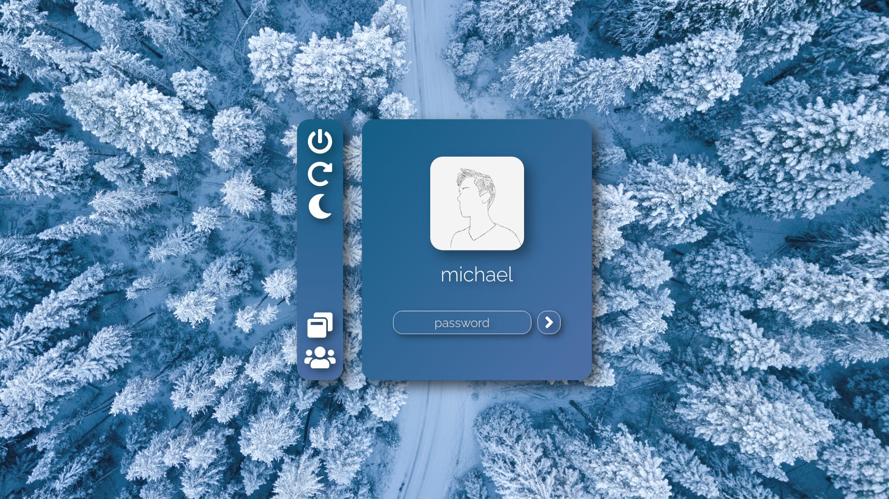
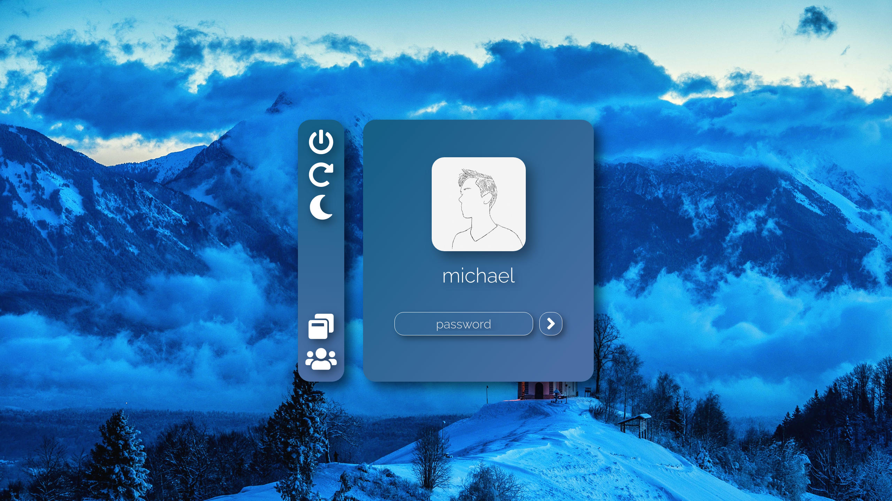
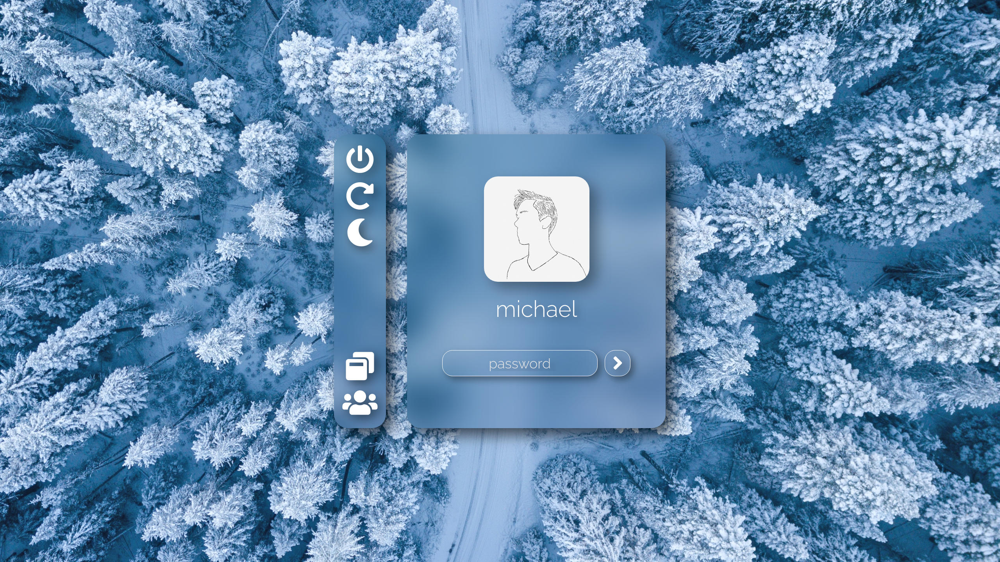
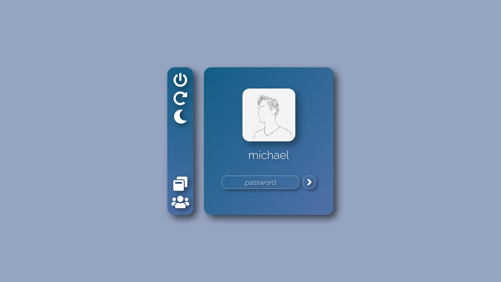

# lightdm-frost

## Previews


### Preview 1



[Background](https://www.pexels.com/photo/aerial-photography-of-snow-covered-trees-1438761/)

### Preview 2 



[Background](https://www.pexels.com/photo/photo-of-brown-house-near-mountain-1424246/)

### Preview 3



Config:
```
:root {
    --font-color: white;
    --font-color-darkened: #e7e7e7;
    --gradient-start-color: rgba(22, 96, 136, .35);
    --gradient-stop-color: rgba(74, 111, 165, .35);
    --root-font-size: 36px;
    --background-image: url("/usr/share/wallpapers/background_2.jpg");
}
```
[Background](https://www.pexels.com/photo/aerial-photography-of-snow-covered-trees-1438761/)

### Preview 4



Default Config

## Requirements

[lightdm](https://github.com/canonical/lightdm/)

[nody-greeter](https://github.com/JezerM/nody-greeter)

## Installation

1. Set up the requirements
2. Download the [built archive](https://gitlab.com/ihciM/lightdm-frost/-/releases/v0.1.0)
3. Extract the archive
```
tar -xf lightdm-frost-v0.1.0.tar.gz
```
4. Move the dist folder to `/usr/share/web-greeter/themes/frost` make sure there is no dist subdirectory in this location
```
sudo mv dist /usr/share/web-greeter/themes/frost
```
5. Set the theme in `/etc/lightdm/web-greeter.yml` to `frost`:
```
cat /etc/lightdm/web-greeter.yml

...
greeter:
    debug_mode: False
    detect_theme_errors: True
    screensaver_timeout: 300
    secure_mode: True
    theme: frost
    icon_theme:
    time_language:
...
```

## Configuration

The configuration is done using a css file located at `/usr/share/web-greeter/themes/frost/config/config.css`:
```
:root {
    --font-color: white;
    --font-color-darkened: #e7e7e7;
    --gradient-start-color: rgba(22, 96, 136, .35);
    --gradient-stop-color: rgba(74, 111, 165, .35);
    --root-font-size: 36px;
    --background-image: url("/usr/share/wallpapers/background_2.jpg");
}
```
You can change the wallpaper either by replacing the file at `/usr/share/web-greeter/themes/frost/img/background.jpg` or by setting the filepath in the config file